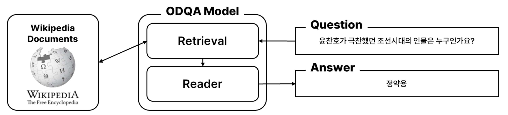

# Open-Domain Question Answering 프로젝트
> 주어진 Open-Domain 질문에 대해 정확한 답변을 생성하는 모델을 개발하는 프로젝트입니다.
> 
> 네이버 커넥트재단 부스트캠프 AI Tech 7기 NLP 과정의 일환으로 3주간 진행했습니다. _(진행기간: 2024.10.02 ~ 2024.10.24)_

## 1. 프로젝트 개요


- **주제**: 미리 구축된 Knowledge Resource를 기반으로 2단계(2-Stage)의 ODQA 모델을 설계하여, Retrieval 단계에서 적합한 문서를 찾아내고, Reader 단계에서 답변을 생성합니다.
- **평가기준**: Exact Match (EM), F1-Score
- [Wrap-Up Report](./assets/wrapup_report.pdf)


## 2. 팀 소개

| 이름 | 담당 역할 |
| --- | --- |
| 서태영 [](https://github.com/sty0507) | 데이터 전처리(Wikipedia), 데이터 증강 (GPT-4o Prompting) |
| 오수현 [](https://github.com/ocean010315) | DPR (SBERT) 구현 및 실험, Generative Reader 실험 (GPT-4o Prompting), Extractive Reader 실험 (KorQuAD FineTuning) |
| 이상의 [](https://github.com/LeSaUi) | 데이터 전처리 (QA Data), Hybrid Retrieval 구현 및 실험 |
| 이정인 [](https://github.com/leeennn) | 데이터 전처리(Context), 데이터 증강 (AEDA) |
| 이정휘 [](https://github.com/LeeJeongHwi) | Inference 구현, Extractive Reader 실험, Ensemble 구현 |
| 정민지 [](https://github.com/minjijeong98) | Sparse Retrieval 구현 및 실험 (TF-IDF, BM25, BGE-M3, SPLADE), 벡터DB 구축 및 실험, Generative Reader 구현 및 실험(Llama 3.1 Instruction tuning), Github 사용 환경 세팅 |


## 3. 성과
최종 리더보드에서 EM(Exact Match) 점수 **66.11%** 달성 _(Baseline 33.06% 대비 **33.05%p 개선**)_


## 4. 주요 접근 방법
- **데이터**
	- [데이터 분석](./EDA_team_folder/) 및 [전처리](./data_preprocessing/): 개행(`\n`), 마크다운 문법, 외국어 전처리 및 실험
	- [데이터 증강](./data_augmentation/): AEDA, OpenAI GPT-4o 프롬프트 튜닝
- **Retrieval model**
	- [Sparse](./retrieval/sparse/README.md): TF-IDF, BM25, BGE-M3, SPLADE
	- [Dense](./retrieval/dense/README.md): Bi-Encoder, Cross-Encoder, 2-stage retrieval
	- [Hybrid](./retrieval/hybrid/readme.md): re-rank, hybrid approach
- **Reader Model**
	- [Extractive](./reader/extractive/README.md): BERT, RoBERTa, KoELECTRA fine-tuning
	- [Abstractive](./reader/abstractive/): GPT-4o Prompt Tuning, Llama-3.1-8B Q-LoRA Instruction Tuning
- **Ensemble**: Hard voting


## 5. 개발 환경
- **Hardware**: Tesla V100 GPU (4 servers)
- **Software**: Linux, Git, Python (3.10.15 버전)
- **협업 도구**: 
    - Github: 진행 상황 추적 및 코드 버전 관리
    - Confluence: 프로젝트 단위 작업 결과 기록

## 6. 설치 및 사용법
아래의 실행 방법은 최상위 폴더 기준입니다. 구체적인 내용은 [ODQA README](./ODQA/README.md)를 참조하세요.

### 1) 필수 라이브러리 설치
```python
# 필수 라이브러리 설치
pip install -r requirements.txt

# konlpy.tag의 Mecab() 토크나이저 설치
bash install_mecab.sh
```

### 2) Sparse Retrieval 임베딩 파일 생성
- `sparse_train.sh` 스크립트 실행

```bash
bash sparse_train.sh
```

### 3) Reader 모델 학습
- Extractive 모델 학습은 `train_mrc.sh` 스크립트를 사용하며, `--type=ext` 옵션을 포함해야 합니다.
- 자세한 설정 방법은 [Extractive README](./reader/extractive/README.md)를 참조하세요.

```bash
bash train_mrc.sh --type=ext --do_eval
```

### 4) inference 실행
- ODQA 모델을 테스트하려면 `inference.sh` 스크립트를 실행합니다.
- 평가 모드로 실행하려면 `--do_eval` 옵션을 추가하고, 예측 결과 저장 시 `--do_predict` 옵션을 사용합니다.
- 자세한 설정 방법은 [ODQA README](./ODQA/README.md)를 참조하세요.

```bash
# 평가 모드
bash inference.sh --qa ext --retrieval sparse --do_eval

# 예측 결과 저장
bash inference.sh --qa ext --retrieval sparse --do_predict
```

## 7. 코드 구조
```text
level2-mrc-nlp-06
├── Data
│   ├── EDA		   # EDA 수행 노트북 파일
│   ├── preprocessing      # 데이터 전처리
│   ├── augmentation       # 데이터 증강
├── retrieval              # Retrieve 모델 관련 코드
│   ├── sparse
│   ├── dense
│   └── hybrid
├── reader                 # Reader 모델 관련 코드
│   ├── abstractive
│   ├── extractive
│   └── utils
├── ODQA                   # ODQA 추론 코드
├── ODQA2                  # Retrieval과 Reader에 서로 다른 버전의 데이터셋 적용 가능 ODQA 추론 코드
├── sparse_train.sh        # Sparse Retrieval 임베딩 생성을 위한 실행 스크립트
├── train_mrc.sh           # Reader 모델 fine-tuning을 위한 실행 스크립트
├── inference.sh           # 전체 ODQA 수행을 통해 평가 및 예측을 위한 실행 스크립트
├── README.md
├── assets
└── requirements.txt
```
